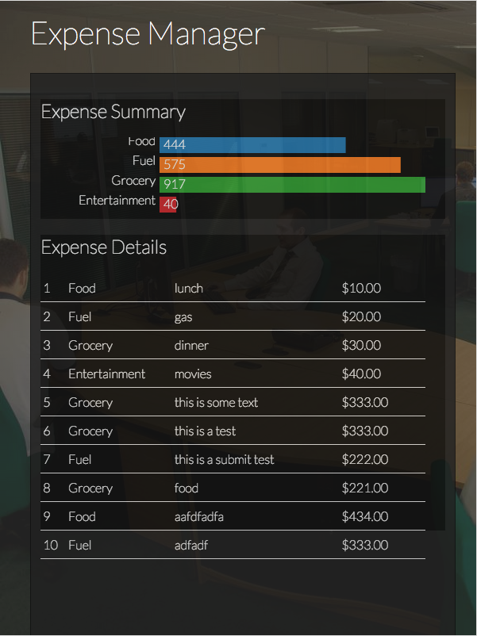

# Expense Manager Mobile Application

This project stems from the the Packt site http://masteringmean.com site. I've forked an already forked angular-seed project and followed along with the tutorial at https://masteringmean.com/lessons/434?li=1. The example can also be found in the book AngularJS Web Application Blueprints by Vinci Rufus.

# Added by Me

I've added some functionality to delete items in localStorage by adding the localStorage key to the object, then later passing it back to the controller and service from the view summary. We remove the item from the displayed summary and then delete via the service.

I also added some code to set the form to pristine and clear the fields after submit. Note that I had to delete the expense object to actually clear the field...

I also added angular-flash-alert module and present a success message for adding and deleting expense items.

# angular-seed — the seed for AngularJS apps

This project is an application skeleton for a typical [AngularJS](http://angularjs.org/) web app.
You can use it to quickly bootstrap your angular webapp projects and dev environment for these
projects.

The seed contains a sample AngularJS application and is preconfigured to install the Angular
framework and a bunch of development and testing tools for instant web development gratification.

The seed app doesn't do much, just shows how to wire two controllers and views together.
